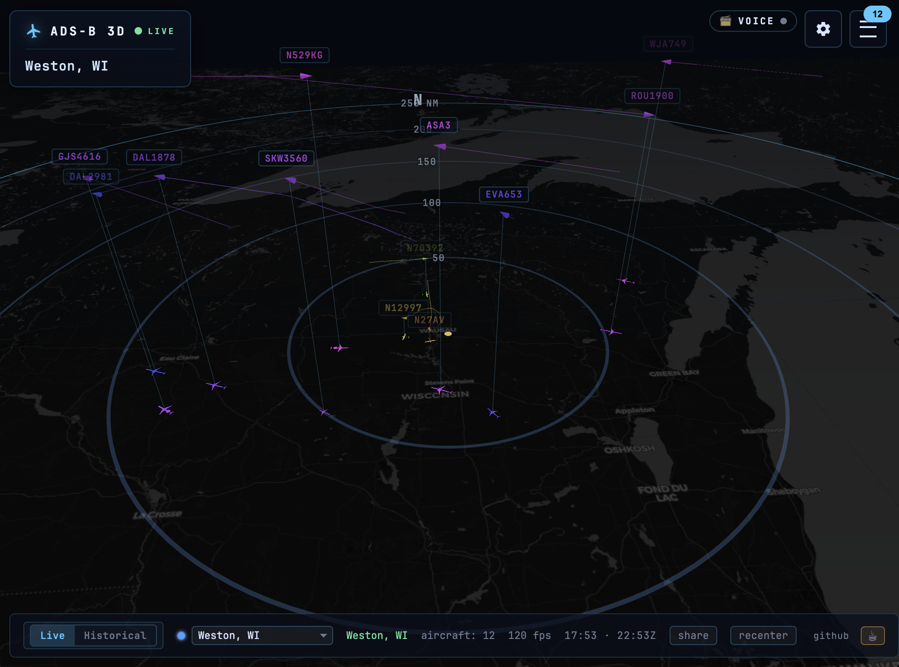
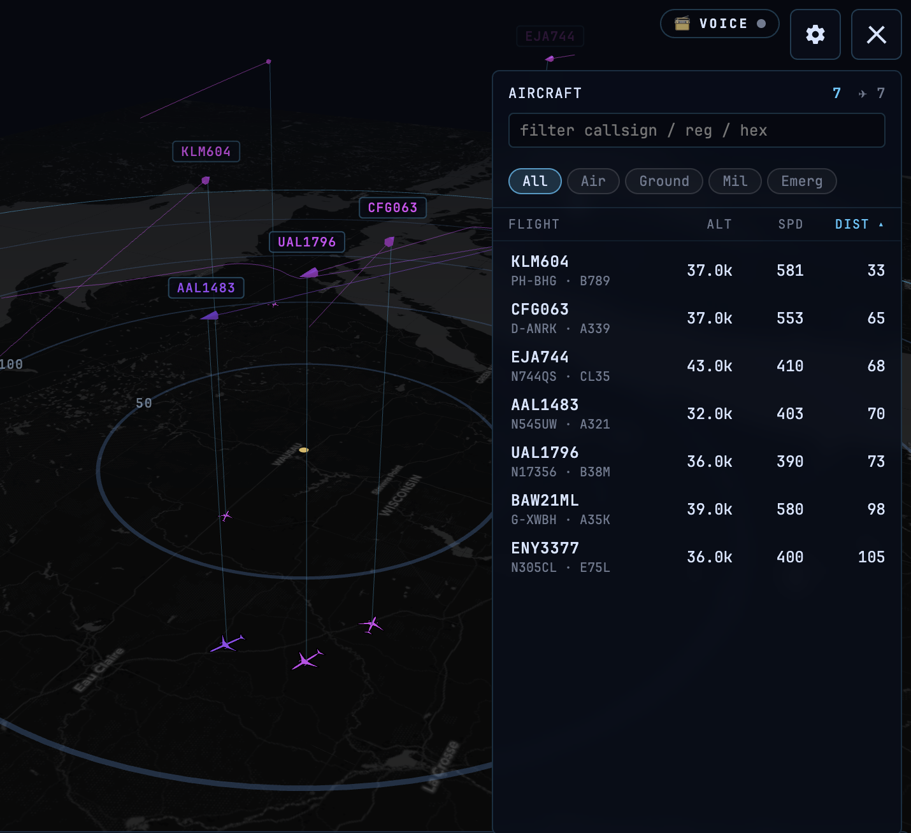
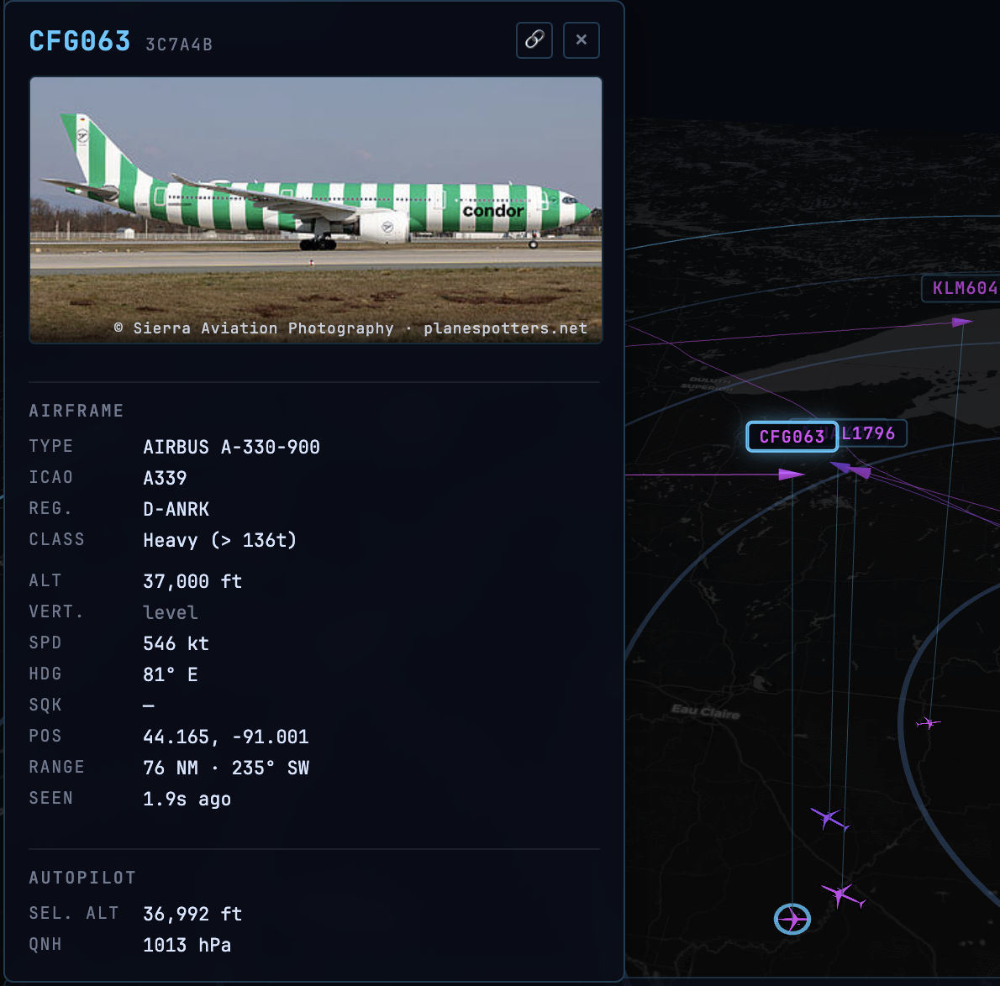
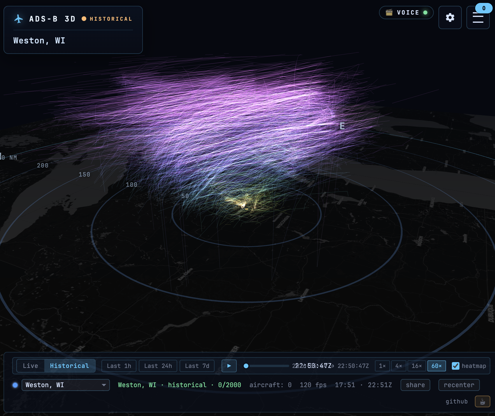

# ADS-B 3D

[](https://github.com/hook-365/adsb-3d/releases)
[](https://github.com/hook-365/adsb-3d/graphs/contributors)
[](https://github.com/hook-365/adsb-3d/issues)

Real-time 3D visualization of ADS-B aircraft, with historical playback,
3D airway-density heatmaps, and optional ACARS message decoding. One
Docker image: it serves the viewer and reverse-proxies your existing
ADS-B feeder.

Works with anything that publishes readsb's `aircraft.json` — tar1090,
ultrafeeder, dump1090-fa, readsb-protobuf, and so on.

**[Live demo →](https://adsb3d.hook.technology)** — explore a running instance in your browser.

> [!WARNING]
> **Ran the older monolithic version?** This is a ground-up rewrite and
> carries **breaking changes** — read [Upgrading](#upgrading) before you pull.



## VR & AR

Put the airspace on your desk. With a WebXR headset the scope becomes a
walkable diorama: orbit a selected aircraft, free-fly through the
traffic, change settings from a wrist menu, or enter AR and drop the map
onto real furniture with a glance and a trigger pull.

https://github.com/user-attachments/assets/a8a1f6ba-8fe8-4c3b-ad88-d2dae76e2281

Demo recorded on a Quest 3 by [@tyzbit](https://github.com/tyzbit), who
hardware-tested every iteration of these features. The
[full-length demo](https://github.com/hook-365/adsb-3d/releases/download/v0.6.0/ADS-B-3D-VR-AR-demo.mp4)
is attached to the v0.6.0 release.

## Built with the community

This project is better because people showed up:

- **[@tyzbit](https://github.com/tyzbit)** — requested VR support, then
  became the entire hardware QA department for it: two rounds of Quest 3
  testing with annotated videos, the bug isolation that cracked the AR
  rendering freeze, the control-scheme design that became free-fly mode,
  the altitude-scale idea ([#8](https://github.com/hook-365/adsb-3d/issues/8)) that became the vertical scale slider,
  and the VR/AR demo video above.
- **[@ValkyrieUK](https://github.com/ValkyrieUK)** — built the
  full-stack Docker integration test suite and CI workflow ([#9](https://github.com/hook-365/adsb-3d/issues/9)), and
  caught a bug that silently broke retention on every fresh install.
- **[@unLieb](https://github.com/unLieb)** — scoped the localization
  architecture before a line was written ([#10](https://github.com/hook-365/adsb-3d/issues/10)) and is the native-speaker
  reviewer for the German translation.
- **[@rknobbe](https://github.com/rknobbe)** — asked the "can it render
  the mountains?" question ([#7](https://github.com/hook-365/adsb-3d/issues/7)) that became 3D terrain.

Want your name here? Issues with reproduction steps, hardware testing,
and translations count just as much as code.

## What you get

**Live mode** — per-second updates with a tar1090 altitude color palette
across cones, trails, ground icons, and labels. Click an aircraft for a
detail card: photo, filed route, airframe, and autopilot data when
broadcast. Filter pills (`All / Air / Ground / Mil / Emerg`) drive both
the list and the 3D scene; emergency squawks get a pulsing red ring.
Mobile-friendly — the sidebar collapses and settings open as a sheet.




**Historical mode** (needs track-service + TimescaleDB) — scrub a
timestamp cursor across the last 1h / 24h / 7d at 1×–60× speed. The **3D
airway-density** overlay renders every flight path at its real altitude,
so busy airways and approach corridors light up as bright bundles in the
sky.



**ACARS** (needs acars-service) — per-aircraft datalink messages in the
detail card with an OOOI flight-phase chip (taxi-out / airborne / taxi-in
/ at gate), a searchable full-page browser, and a 3D ping ring when a
message lands for an aircraft on scope.

**Multi-feed** — point at several receivers and the status bar grows a
feed picker. Switching is in-place — no page reload.

**Themes** — five built-in palettes (Midnight Glass, Daylight, Sectional
Chart, Phosphor CRT, High Contrast) pickable from the settings panel.
`Auto` follows your system light/dark preference. Switching is live; the
3D scene re-tints in place. Plays especially well with the FAA chart
basemaps below.

**Languages** — English, German, and Spanish (translations are
machine-drafted pending native review — corrections welcome). `Auto`
follows your browser locale.

**3D terrain** (opt-in) — the basemap rises to real ground elevation,
with range rings, markers, and aircraft ground icons draped over the
hills and an above-ground-level readout in the detail card. Free
elevation data, no API key. Pairs beautifully with the OpenTopoMap
basemap. With terrain off, the flat map stands at the home field's
elevation, so landing traffic meets the map instead of floating at
field-elevation height above it. A companion
**altitude scale** slider warps the vertical axis toward low-altitude
detail (pattern traffic spreads out) or high-altitude detail (flight
levels spread out) — terrain and aircraft stay consistent at any
position.

**VR / AR (experimental)** — "Enter VR" opens an immersive WebXR
session for any connected headset, with laser-pointer controllers, an
in-VR wrist menu for settings, and thumbstick locomotion with comfort
options (scope vs free-fly movement, snap vs smooth turning, B/Y
cycles through aircraft). "Enter AR" opens a passthrough session on
devices that support `immersive-ar`. Built without a real headset on
hand, so issue reports are welcome. Side-by-side stereo (Cardboard) is
still there for anything without WebXR.

**FAA aeronautical charts** (US only) — Sectional, Helicopter, IFR Low,
IFR High, and a sectional + roads hybrid, served through the same tile
proxy as the regular basemaps. The container auto-discovers the current
FAA 56-day chart cycle at start, so the upstream URL stays valid through
each rotation as long as you restart the container occasionally.

**Voice scanner** (needs a separate voice stack) — an optional VHF
airband call feed, shown only on the local feed. See
[docs/VOICE.md](docs/VOICE.md).

## Prerequisites

- Docker Engine 20+ and Docker Compose v2
- An ADS-B feeder already publishing `aircraft.json` (tar1090,
  ultrafeeder, dump1090-fa, readsb-protobuf, …)

## Quick start

```yaml
services:
  adsb-3d:
    image: ghcr.io/hook-365/adsb-3d:latest
    ports: ["8086:80"]
    environment:
      - LATITUDE=45.0000
      - LONGITUDE=-90.0000
      - ALTITUDE=1000
      - LOCATION_NAME=My Station
      - FEEDER_URL=http://ultrafeeder
```

`docker compose up -d`, then open `http://localhost:8086/` — your
aircraft should appear within a few seconds.

**`FEEDER_URL` must be reachable from inside the container.** A bare
service name like `http://ultrafeeder` only resolves if adsb-3d shares a
Docker network with your feeder. If it doesn't, use the feeder's host IP
and port — e.g. `http://192.168.1.50:8080`. If the page loads but stays
empty, this is almost always why: check `docker logs adsb-3d` (the
container reports `unhealthy` until it can reach the feeder).

For historical playback, ACARS, or the voice scanner, copy
`.env.example` to `.env` and start from `docker-compose.example.yml`
in the repo root. Both have track-service, ACARS, and TimescaleDB
ready to uncomment; the `ENABLE_*` flags below switch each on.

## Reverse proxy

adsb-3d runs on a subdomain or a subpath (`example.com/3d`). The
entrypoint auto-detects the subpaths `/3d`, `/adsb`, and `/adsb-3d` when
your proxy passes the prefix through; set `BASE_PATH` if the proxy strips
the prefix or uses a different path. Worked configs for nginx, Traefik,
Caddy, Apache, and Nginx Proxy Manager are in
[docs/REVERSE-PROXY.md](docs/REVERSE-PROXY.md).

## Multi-feed

Define each feed with flat `FEEDN_*` env vars — the entrypoint
synthesises the rest:

```env
FEED1_NAME=Home Station
FEED1_LAT=45.0000
FEED1_LON=-90.0000
FEED1_ALT=1000                # feet MSL, like all altitudes here
FEED1_ACARS=true              # optional

FEED2_NAME=Remote Site
FEED2_URL=192.0.2.10:8086     # host:port of another adsb-3d instance
FEED2_LAT=43.0000
FEED2_LON=-89.0000
FEED2_COLOR=#ff8c4c           # optional
```

Slot 1 is always local — `FEED1_URL` is ignored. Slots 2+ point at other
adsb-3d instances and the entrypoint wires up the nginx proxy blocks.
Parsing stops at the first missing `FEEDN_NAME`.

## Environment variables

**Core:**

| Variable | Default | Purpose |
|---|---|---|
| `LATITUDE` / `LONGITUDE` / `ALTITUDE` | — | Receiver location; `ALTITUDE` in **feet** MSL (as are all `FEEDN_ALT`) |
| `LOCATION_NAME` | `Home` | Display name |
| `FEEDER_URL` | `http://ultrafeeder` | Anything publishing `/data/aircraft.json` — must be reachable from the container |
| `ENABLE_HISTORICAL` | `false` | Historical playback UI (needs track-service) |
| `ENABLE_ACARS` | `false` | ACARS panel (needs acars-service) |
| `ENABLE_VOICE` | `false` | VHF voice scanner panel (see [docs/VOICE.md](docs/VOICE.md)) |
| `ENABLE_TERRAIN` | `true` | Deploy-level 3D-terrain kill switch (users still opt in per-browser) |
| `HIDE_TOWER` | `false` | Hide the home tower marker |
| `TRACK_API_HOST` | `track-service:8000` | nginx upstream |
| `ACARS_API_HOST` | `acars-service:8000` | nginx upstream |
| `VOICE_EVENTS_HOST` | — | nginx upstream for `/voice/calls` + `/voice/ws` — what the frontend uses |
| `VOICE_STREAM_HOST` | — | required when voice is on; point at any reachable `host:port` (legacy Icecast block, not played by the frontend) |

**Multi-feed:** `FEEDN_NAME`, `FEEDN_LAT`, `FEEDN_LON`, `FEEDN_ALT`,
`FEEDN_URL`, `FEEDN_COLOR`, `FEEDN_ACARS` — see [Multi-feed](#multi-feed).

**Reverse proxy:** `BASE_PATH` overrides the auto-detected subpath
(see [Reverse proxy](#reverse-proxy)).

## Controls

Mouse: **left-drag** orbits the camera, **scroll** zooms, **right-drag** pans
the view (moves the center point).

| Key | Action |
|---|---|
| Arrow keys | Pan the view across the map |
| `R` | Recenter camera + clear selection |
| `/` | Focus the list search box |
| `Esc` | Close settings panel or ACARS browser |

## Upgrading

The older version was a single ~14k-line vanilla-JS app; this is a
TypeScript / Three.js rewrite. Most deployments keep working after a
pull, but review these first:

- **`ENABLE_HISTORICAL` defaults to `false`** (was `true`) — set it
  explicitly to `true` if you run `track-service`.
- **`ENABLE_VOICE=true` now requires `VOICE_STREAM_HOST` +
  `VOICE_EVENTS_HOST`** — the container fails fast without them.
- **`track-service` / `acars-service` run as non-root** (uid `10001`) —
  host paths bind-mounted into them must be writable by that uid.

Full detail in [CHANGELOG.md](CHANGELOG.md).

## Architecture

```
                ┌──────── browser ────────┐
                │  Vite/TS Three.js app   │
                └───────────┬─────────────┘
                            │
                       nginx (port 80)
                            │
      ┌──────────┬──────────┼──────────┬──────────────┐
      │          │          │          │              │
   /data/...  /api/...   /ws/...  /api/feeds/N/...  /acars-api/
      │          │          │          │              │
 ultrafeeder  track-service │   remote adsb-3d   acars-service
                  │             instance (slot N)
                  ▼
            TimescaleDB
       (aircraft_positions
        + aircraft_metadata
        + acars_messages)
```

- **`frontend/`** — Vite + TypeScript + Three.js viewer, no framework.
- **`track-service/`** — FastAPI + asyncpg; a live WebSocket diff stream
  plus a TimescaleDB history collector.
- **`acars-service/`** — FastAPI bridge to an acarshub TCP feed.
- **`nginx/`** — reverse proxy + static host; `entrypoint.sh` renders the
  config (including per-feed proxy blocks) from env vars at start.

See [CLAUDE.md](CLAUDE.md) for a deeper architecture orientation.

## Development

```sh
cd frontend
npm install
npm run dev         # Vite dev server
npm run typecheck   # tsc, strict
npm run test        # Vitest
npm run build       # → dist/
```

`npm run dev` proxies backend routes to `http://localhost:8080`; override
with `DEV_BACKEND`. To run the full container against an existing backend:

```sh
docker compose -f docker-compose.dev.yml --project-directory . up --build -d
# → http://localhost:8186/
```

## Credits

- **tar1090** ([wiedehopf/tar1090](https://github.com/wiedehopf/tar1090),
  GPL v2+) — SVG aircraft shape catalog and the altitude → color palette.
- **readsb / dump1090-fa** — upstream Mode S/ADS-B decoder.
- **planespotters.net** — aircraft photographs in the detail panel.
- **adsb.im** — callsign → route resolution.
- **OpenStreetMap, Carto, ESRI, OpenTopoMap** — basemap tile providers.
- **[VFRMap](https://vfrmap.com)** — hosting for FAA Sectional / Helicopter
  / IFR Low / IFR High chart tiles, kept in sync with the FAA 56-day cycle.
  Free non-commercial service; please don't abuse it.

## Recent changes

The full history lives in [CHANGELOG.md](CHANGELOG.md).

- **v0.6.0** (2026-08-05): The sky lands on your desk. AR place mode
  (look at a surface, pull the trigger, the scope parks there), a paged
  wrist menu with full settings parity, free-fly tuned by real Quest 3
  feedback, resolution-true fat lines, per-eye stereo controls, and a
  mobile bottom-sheet redesign of the aircraft detail card.
- **v0.5.3** (2026-08-03): Flat mode grounds at the home field's
  elevation instead of sea level, so high-elevation stations read right
  with terrain off too. Docs now state all altitudes are feet MSL.
- **v0.5.2** (2026-08-03): Terrain polish — ground icons drape over the
  hills shadow-style instead of being sliced by them, the emergency ring
  rides the terrain, and high-elevation feeds no longer flash aircraft
  at sea level while elevation tiles load.
- **v0.5.1** (2026-08-03): The integration test suite + CI from #9
  (thanks @ValkyrieUK), the fresh-install retention-policy fix, and
  polite 5 s polling of remote feeders (local feeders keep 1 s;
  `FEEDER_POLL_SECONDS` overrides).
- **v0.5.0** (2026-08-03): The community-issues release: localization
  (English/German/Spanish), the altitude scale slider, opt-in 3D
  terrain with draped rings and AGL readout, VR comfort options, and
  the fix for the AR rendering freeze.
- **v0.4.0** (2026-05-28): Performance + UX push for high-density
  feeds. Virtualized aircraft list, click-to-extend trails with 24 h
  backfill, search filters the scene as well as the list, lazy-loaded
  feature modules, and a long list of reconciler / trail / bundle
  optimizations.
- **v0.3.0** (2026-05-27): WebXR for real headsets (experimental), with
  controllers, an in-VR wrist menu, locomotion, and AR passthrough.
- **v0.2.0** (2026-05-27): Five color themes (auto-follows system
  light/dark) and FAA aeronautical chart basemaps (US only).
- **v0.1.1** (2026-05-22): `HIDE_TOWER=true` now hides the home marker
  on the map as well as the HUD coordinates.
- **v0.1.0** (2026-05-21): First public release of the TypeScript /
  Three.js rewrite. See the [Upgrading](#upgrading) section.

## License

Source code is MIT (see `LICENSE`). Vendored tar1090 data
(`frontend/src/aircraft/shapes-data.json`) is GPL v2+ per upstream — if
you redistribute the built app, GPL governs that component.
